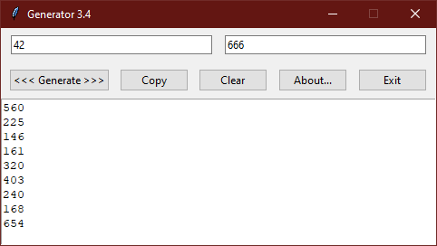

<div align="center">


# Generator

**[EN](README.md) / [RU](README-RU.md)**

</div>

**Generator** - простая, легковесная, минималистичная программа
для генерации случайных чисел. Программа написана на Python
и имеет графический интерфейс, построенный с использованием
библиотеки Tkinter.

Пользователи Windows 7 и более новых версий ОС могут использовать готовый
собранный исполняемый файл приложения (`generator.exe`), доступный
в дистрибутиве.

Вы также можете запустить скрипт вручную при условии, что у вас установлен
Python 3:

```
python generator.py
```

или, если вы работаете в Linux или любой другой UNIX-подобной ОС:

```
chmod +x generator.py && ./generator.py
```

Исполняемый файл для вашей платформы можно собрать самостоятельно,
установив модуль PyInstaller и запустив скрипт `make.bat` (Windows)
или `make.sh` (UNIX-подобные ОС). При необходимости скрипт можно
настроить под себя.

**Разработчики:**
* [Ertorik](https://github.com/MrErtor) (2021 - 2022)\
*Идея, программирование, графическое оформление*
* [AngelOfV0id](https://github.com/AngelOfV0id) (2022 - 2024)\
*Программирование, графическое оформление,
обновлённый README, сборка для Win32*
* [rilysh](https://github.com/rilysh) (2022)\
*Программирование (незначительные улучшения в коде программы)*

Generator является **бесплатным и открытым программным обеспечением**
и распространяется на условиях лицензии
[GNU General Public License 3.0](license.txt).

<div align="center">



</div>