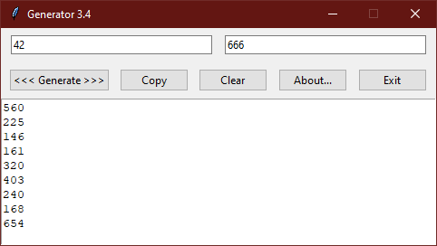

<div align="center">


# Generator

**[EN](README.md) / [RU](README-RU.md)**

</div>

**Generator** is a simple, lightweight and minimalistic random number
generation tool written in Python with the usage of Tkinter (GUI framework).
Generator is cross-platform and can work on many popular desktop platforms
like Windows and Linux.

Windows 7+ users can use the pre-built binary file (`generator.exe`)
which is available in the distribution of the application.

You can also execute the script file manually if you have Python 3 installed:

```
python generator.py
```

or, if you are working under Linux or some other UNIX-like OS:

```
chmod +x generator.py && ./generator.py
```

The executable file can be built for your platform by installing
PyInstaller module and executing `make.bat` (Windows)
or `make.sh` (UNIX-like OS) shell script. You can tweak these scripts
if you need.

**Authors:**
* [Ertorik](https://github.com/MrErtor) (2021 - 2022)\
*Idea, code, design*
* [AngelOfV0id](https://github.com/AngelOfV0id) (2022 - 2024)\
*Code, design, updated README, Win32 build*
* [rilysh](https://github.com/rilysh) (2022)\
*Code (minor improvements contributed)*

Generator is **free and open source software**
and is distributed under the terms of
[GNU General Public License 3.0](license.txt).

<div align="center">



</div>